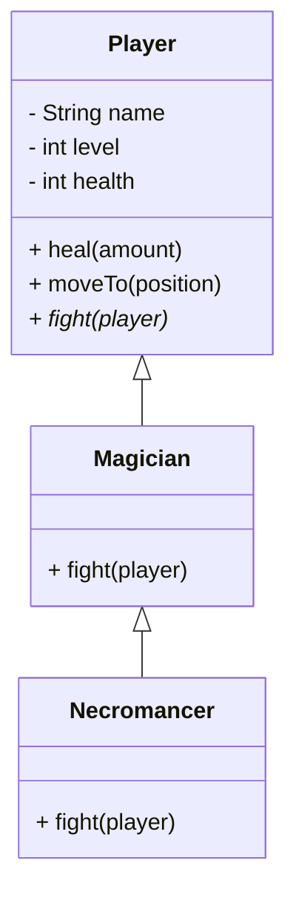

## Dungeons and Dragons

```mermaid
classDiagram
  Player <|-- Magician
  Magician <|-- Necromancer

  class Player {
    - String name
    - int level
    - int health
    + heal(amount)
    + moveTo(position)
    + fight(player)*
  }

  class Magician {
    + fight(player)
  }

  class Necromancer {
    + fight(player)
  }
```
